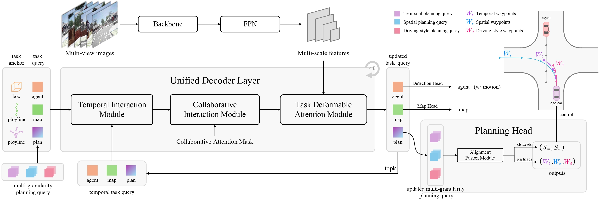

<div align="center">
<h1>HiP-AD</h1>
<h3>  HiP-AD: Hierarchical and Multi-Granularity Planning with Deformable Attention for Autonomous Driving in a Single Decoder </h3>

[arxiv paper](https://arxiv.org/abs/2503.08612) [project page](https://nullmax-vision.github.io/hipad_static/)


</div> 

 
## Introduction



- We propose a **multi-granularity planning** query representation that integrates various characteristics of waypoints to enhance the diversity and receptive field of the planning trajectory, enabling additional supervision and precise control in a closed-loop system.
- We propose a **planning deformable attention** mechanism that explicitly utilizes the geometric context of the planning trajectory, enabling dynamic retrieving image features from the physical neighborhoods of waypoints to learn sparse scene representations.
- We propose a **unified decoder** where a **comprehensive interaction** is iteratively conducted on planning-perception and planning-images, making an effective exploration of end-to-end driving in both BEV and perspective view, respectively. 


## Citation
```bibtex
@article{tang2025hipad,
  title={HiP-AD: Hierarchical and Multi-Granularity Planning with Deformable Attention for Autonomous Driving in a Single Decoder},
  author={Yingqi Tang and Zhuoran Xu and Zhaotie Meng and Erkang Cheng},
  journal={arXiv preprint arXiv:2503.08612},
  year={2025}
}

```